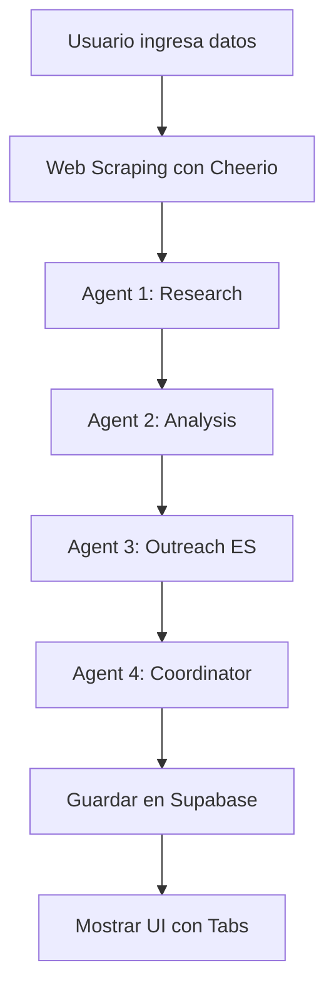

# 🚀 Guía de Configuración - Sales Intelligence Tool

## ✅ Lo que se ha construido

Una herramienta completa de inteligencia de ventas con 4 agentes AI de Claude trabajando en secuencia para analizar prospectos y generar estrategias personalizadas de outreach.

### Estructura del Proyecto

```
sales-team-ai/
├── app/
│   ├── api/
│   │   ├── agents/
│   │   │   ├── research/route.ts      # Agente 1: Investigador
│   │   │   ├── analysis/route.ts      # Agente 2: Analista
│   │   │   ├── outreach/route.ts      # Agente 3: Writer (Español)
│   │   │   └── coordinator/route.ts   # Agente 4: Coordinador
│   │   └── prospects/
│   │       └── analyze/route.ts       # Orquestador principal
│   └── dashboard/
│       └── prospectos/
│           ├── page.tsx               # Formulario y resultados
│           └── historial/
│               ├── page.tsx           # Lista de prospectos
│               └── [id]/page.tsx      # Detalle de análisis
├── lib/
│   ├── ai/
│   │   └── anthropic.ts               # Cliente de Anthropic
│   └── utils/
│       └── web-fetcher.ts             # Scraping de sitios web
├── supabase/
│   └── schema.sql                     # Schema completo de BD
└── components/
    └── layout/
        └── Sidebar.tsx                # Navegación actualizada
```

## 📋 Pasos de Configuración

### 1. Configurar Variables de Entorno

Edita el archivo `.env.local` y completa estos valores:

```bash
# Supabase - Obtén esto de tu proyecto en supabase.com
NEXT_PUBLIC_SUPABASE_URL=https://tu-proyecto.supabase.co
NEXT_PUBLIC_SUPABASE_ANON_KEY=eyJhbGciOiJIUzI1NiIsInR5cCI6IkpXVCJ9...
SUPABASE_SERVICE_ROLE_KEY=eyJhbGciOiJIUzI1NiIsInR5cCI6IkpXVCJ9...

# Anthropic - Obtén tu API key en console.anthropic.com
ANTHROPIC_API_KEY=sk-ant-api03-xxxxxxxxxxxxx

# Site URL - Cambia a tu dominio en producción
NEXT_PUBLIC_SITE_URL=http://localhost:3000

# OpenAI (opcional - solo para features existentes)
OPENAI_API_KEY=sk-proj-xxxxxxxxxxxxx
```

### 2. Configurar Base de Datos Supabase

1. Ve a tu proyecto en [supabase.com](https://supabase.com)
2. Abre el **SQL Editor**
3. Copia TODO el contenido de `supabase/schema.sql`
4. Pégalo en el editor y ejecuta con **RUN**
5. Verifica que se crearon las tablas:
   - `profiles`
   - `whitelisted_emails`
   - `prospects`
   - `agent_results`
   - `icps`
   - `leads`
   - `lead_activities`

### 3. Whitelist de Emails del Equipo

En el SQL Editor de Supabase, ejecuta:

```sql
-- Añade los emails de tu equipo
INSERT INTO public.whitelisted_emails (email) VALUES
  ('edwin@verymuch.ai'),
  ('team1@verymuch.ai'),
  ('team2@verymuch.ai');
```

Solo estos emails podrán registrarse en la aplicación.

### 4. Obtener API Key de Anthropic

1. Ve a [console.anthropic.com](https://console.anthropic.com/)
2. Login o crea una cuenta
3. Ve a **API Keys**
4. Crea una nueva key
5. Cópiala y pégala en `.env.local`

**Importante**: El modelo usado es `claude-opus-4-20250514` (el más potente). Asegúrate de tener créditos en tu cuenta de Anthropic.

### 5. Instalar Dependencias (Ya hecho)

Las dependencias ya están instaladas:
- ✅ `@anthropic-ai/sdk` - Cliente de Claude
- ✅ `cheerio` - Web scraping
- ✅ Resto de dependencias existentes

### 6. Ejecutar la Aplicación

```bash
# Modo desarrollo
npm run dev

# La app estará en http://localhost:3000
```

## 🧪 Probar la Aplicación

### Primera Vez

1. Abre [http://localhost:3000](http://localhost:3000)
2. Ve a `/signup` y regístrate con un email whitelisted
3. Login con tus credenciales
4. Serás redirigido al dashboard

### Analizar un Prospecto

1. En el sidebar, click en **"Prospectos AI"** ✨
2. Completa el formulario:
   ```
   Nombre de Empresa: Factorial HR
   Sitio Web: https://factorialhr.com
   Nombre del Contacto: Jordi Romero
   Cargo: CEO
   LinkedIn: https://linkedin.com/in/jordiromeropuig
   Notas: SaaS de RRHH en España, posible lead HOT
   ```
3. Click en **"Analizar Prospecto"**
4. Espera 1-2 minutos (verás el progreso)
5. Revisa los 4 tabs con los resultados

### Ver Historial

1. Desde la página de resultados, click en **"Ver Historial"**
2. O navega a `/dashboard/prospectos/historial`
3. Busca y filtra prospectos
4. Exporta a CSV si necesitas

## 🎨 Características Implementadas

### ✅ Autenticación y Seguridad
- Login/Signup con Supabase Auth
- Whitelist de emails del equipo
- Rutas protegidas con middleware
- Row Level Security en base de datos

### ✅ Pipeline de 4 Agentes AI
- **Researcher**: Investiga la empresa y construye perfil
- **Analyst**: Puntúa ICP fit (1-10) y timing (1-10)
- **Writer**: Genera 3 mensajes en español personalizado
- **Coordinator**: Sintetiza todo en plan de acción

### ✅ UI/UX
- Dark mode con color primario púrpura (#7C3AED)
- Formulario completo de entrada
- Progress indicator en tiempo real
- Tabs de resultados con copy-to-clipboard
- Responsive y mobile-friendly
- Todo en español

### ✅ Gestión de Datos
- Guarda prospectos en Supabase
- Guarda resultados de agentes
- Historial completo con búsqueda y filtros
- Exportación a CSV
- Vista de detalle de cada análisis

## 🔍 Arquitectura del Pipeline



Cada agente es una llamada separada a Claude API con:
- System prompt específico
- Contexto de agentes anteriores
- Max tokens optimizado
- Modelo: `claude-opus-4-20250514`

## 📊 Costos Estimados (Anthropic)

Cada análisis completo consume aproximadamente:
- Research: ~1,500 tokens input, ~1,000 tokens output
- Analysis: ~2,000 tokens input, ~800 tokens output
- Outreach: ~2,500 tokens input, ~600 tokens output
- Coordinator: ~4,000 tokens input, ~1,000 tokens output

**Total por análisis**: ~10,000 tokens input + ~3,400 tokens output

Con precios de Claude Opus 4:
- Input: $15 por 1M tokens
- Output: $75 por 1M tokens

**Costo estimado por análisis**: ~$0.40 USD

## 🐛 Troubleshooting

### Error: "Missing ANTHROPIC_API_KEY"
- Verifica que `.env.local` tenga la variable configurada
- Reinicia el servidor de desarrollo (`npm run dev`)

### Error: "Unauthorized" en análisis
- Verifica que estés logueado
- Chequea que el middleware esté funcionando
- Revisa que las tablas de Supabase tengan RLS habilitado

### El análisis falla o toma mucho tiempo
- Chequea la consola del navegador y terminal
- Verifica tu cuenta de Anthropic tenga créditos
- El timeout es de 5 minutos (300 segundos)
- Si el sitio web no responde, el análisis continúa sin contenido web

### No puedo registrarme
- Verifica que tu email esté en la tabla `whitelisted_emails`
- Ejecuta el SQL para agregar tu email

### Los mensajes de outreach no están en español
- El system prompt del Writer agent está configurado para español
- Si falla, puede ser un problema con el modelo
- Verifica que uses `claude-opus-4-20250514`

## 📚 Próximos Pasos Recomendados

1. **Testing**: Prueba con varios prospectos reales
2. **Refinamiento**: Ajusta los prompts según los resultados
3. **Monitoring**: Agrega logging de errores (Sentry, etc.)
4. **Rate Limiting**: Implementa límites por usuario
5. **Caché**: Considera cachear análisis de sitios web
6. **Webhooks**: Notificaciones cuando el análisis completa
7. **Analytics**: Tracking de uso y costos

## 🎯 Datos de Prueba Recomendados

Empresas SaaS españolas/latinas para probar:

1. **Factorial HR**
   - Web: https://factorialhr.com
   - Perfil: SaaS RRHH, B2B, scaling
   
2. **Platzí**
   - Web: https://platzi.com
   - Perfil: Edtech, suscripción, LATAM

3. **Tiendanube**
   - Web: https://www.tiendanube.com
   - Perfil: E-commerce SaaS, LATAM

## 🤝 Soporte

Para preguntas o issues:
1. Revisa esta guía completa
2. Chequea `README-PROSPECTOS.md` para más detalles
3. Revisa los logs en terminal/consola
4. Contacta al equipo de desarrollo

---

**¡Todo listo para analizar prospectos!** 🚀

La aplicación está 100% funcional. Solo necesitas:
1. ✅ Configurar variables de entorno
2. ✅ Ejecutar el schema SQL en Supabase
3. ✅ Añadir emails whitelisted
4. ✅ Obtener API key de Anthropic
5. 🎉 Empezar a analizar prospectos
